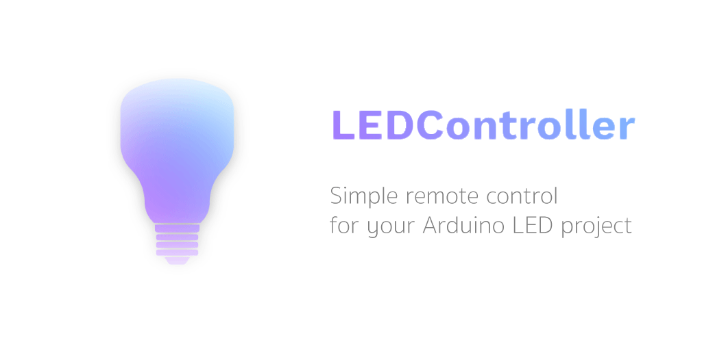
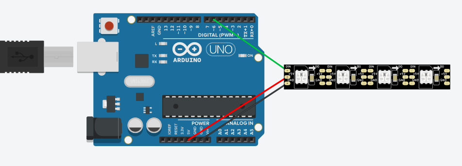

This part of the project establish Arduino code that with no effort allows you to communicate with your LED strips. Project is focused on WS2812b LED strips as they are one of the cheapest and powerful available on the market.

<iframe src="https://giphy.com/embed/dXQkB1S1Fzysr2eBVP" width="480" height="270" frameBorder="0" class="giphy-embed" allowFullScreen></iframe><p><a href="https://giphy.com/gifs/led-strip-ledcontroller-dXQkB1S1Fzysr2eBVP">via GIPHY</a></p>

# Setup

### What's needed
* Any Arduino board. Uno is just perfect to start
* Addressable LED strip compatible with Adafruit NeoPixel
* Smartphone with Android 4.0.3 or higher

### Installation
Just download Arduino code and put it on the board.

You have to also download mobile app. As it is open source you can download it from Google Play Store or assembly on your own.

* Repository - https://github.com/tmaxxdd/LEDController
* Google Play Store - https://play.google.com/store/apps/details?id=com.czterysery.ledcontroller

### Connection
WS28212b standard uses three pins (5V, GND, DIN) and they must be connected to Arduino board. For default it uses pin number 6 to send digital signals (DIN).



### Configuration
First you need configure number of your pixels on the strip.
```cpp
#define DIODECOUNT 5
```
Next select serial commands receiver. During development was used HC-05 Bluetooth module.
```cpp
SoftwareSerial bt(10, 11); // RX, TX
```
For development reason you may want to uncomment all serial prints which should help to find out what commands are properly handled.
```cpp
//   Serial.println(F("LED receiver started"));
```
And mostly is that all! Still you can modify illuminations or combine more independent strips, but this will require some time.

# Contribution

I am willing to consider any contributions on this project. For me it is pre-final version and development isn't planned at this moment. If you find a bug please submit an issue in the appropriate Github's tab.
